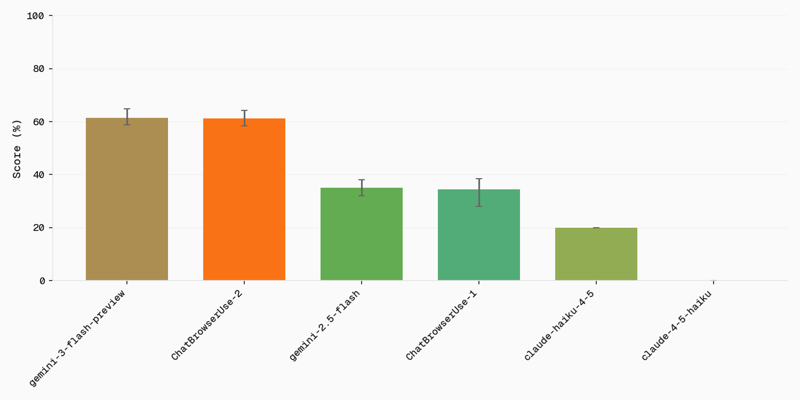
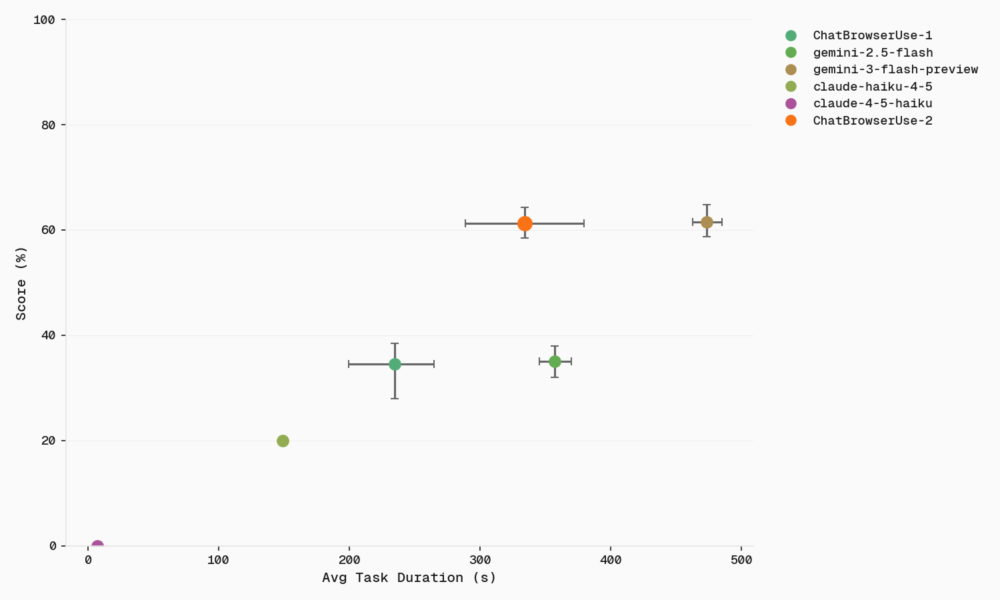

<picture>
  <source media="(prefers-color-scheme: light)" srcset="https://github.com/user-attachments/assets/2ccdb752-22fb-41c7-8948-857fc1ad7e24">
  <source media="(prefers-color-scheme: dark)" srcset="https://github.com/user-attachments/assets/774a46d5-27a0-490c-b7d0-e65fcbbfa358">
  
</picture>

<h1 align="center">BU_Bench_V1</h1>

<p align="center">100 hand-selected tasks for evaluating browser automation agents</p>

---

## Results

<picture>
  <source media="(prefers-color-scheme: light)" srcset="official_plots/accuracy_by_model_light.png">
  <source media="(prefers-color-scheme: dark)" srcset="official_plots/accuracy_by_model_dark.png">
  
</picture>

<picture>
  <source media="(prefers-color-scheme: light)" srcset="official_plots/accuracy_vs_latency_light.png">
  <source media="(prefers-color-scheme: dark)" srcset="official_plots/accuracy_vs_latency_dark.png">
  
</picture>

---

## Quick Start

**1. Install dependencies**
```bash
pip install uv
uv sync
```

**2. Add API keys to `.env`**
```bash
BROWSER_USE_API_KEY=your-key      # Required for ChatBrowserUse and cloud browsers
GOOGLE_API_KEY=your-key           # Required for judge LLM (gemini-2.5-flash)
# Add other provider keys as needed (OPENAI_API_KEY, ANTHROPIC_API_KEY)
```

**3. Run evaluation**
```bash
uv run python run_eval.py
```

Results are saved to `results/` and detailed traces to `run_data/`.

---

## Swapping Models

Edit `run_eval.py` to change the model:

```python
# Default: ChatBrowserUse (recommended)
agent = Agent(task=task["confirmed_task"], llm=ChatBrowserUse(), browser=browser)

# OpenAI
agent = Agent(task=task["confirmed_task"], llm=ChatOpenAI(model="gpt-4.1"), browser=browser)

# Anthropic
agent = Agent(task=task["confirmed_task"], llm=ChatAnthropic(model="claude-sonnet-4-5"), browser=browser)

# Google
agent = Agent(task=task["confirmed_task"], llm=ChatGoogle(model="gemini-2.5-flash"), browser=browser)
```

---

## About the Benchmark

100 tasks drawn from established benchmarks and custom challenges:

| Source | Tasks | Description |
|--------|-------|-------------|
| Custom | 20 | Page interaction challenges |
| WebBench | 20 | Web browsing tasks |
| Mind2Web 2 | 20 | Multi-step web navigation |
| GAIA | 20 | General AI assistant tasks (web-based) |
| BrowseComp | 20 | Browser comprehension tasks |

Tasks are base64-encoded to prevent data contamination in LLM training. Please do not publish tasks in plaintext.

### Task Format

| Field | Description |
|-------|-------------|
| `task_id` | Unique identifier |
| `confirmed_task` | Task instruction |
| `category` | Source benchmark |
| `answer` | Ground truth (if applicable) |

---

## Attributions

### WebBench
MIT License | https://webbench.ai/
```bibtex
@misc{webbench2025,
  title = {WebBench: AI Web Browsing Agent Benchmark},
  author = {{Halluminate and Skyvern}},
  year = {2025},
  note = {\url{https://webbench.ai/}},
}
```

### Mind2Web 2 (OMI2W-2)
MIT License | https://openreview.net/forum?id=AUaW6DS9si
```bibtex
@inproceedings{
    gou2025mind2web2,
    title={Mind2Web 2: Evaluating Agentic Search with Agent-as-a-Judge},
    author={Boyu Gou and Zanming Huang and Yuting Ning and Yu Gu and Michael Lin and Botao Yu and Andrei Kopanev and Weijian Qi and Yiheng Shu and Jiaman Wu and Chan Hee Song and Bernal Jimenez Gutierrez and Yifei Li and Zeyi Liao and Hanane Nour Moussa and TIANSHU ZHANG and Jian Xie and Tianci Xue and Shijie Chen and Boyuan Zheng and Kai Zhang and Zhaowei Cai and Viktor Rozgic and Morteza Ziyadi and Huan Sun and Yu Su},
    booktitle={The Thirty-ninth Annual Conference on Neural Information Processing Systems Datasets and Benchmarks Track},
    year={2025},
    url={https://openreview.net/forum?id=AUaW6DS9si}
}
```

### BrowseComp
MIT License | https://cdn.openai.com/pdf/5e10f4ab-d6f7-442e-9508-59515c65e35d/browsecomp.pdf
```bibtex
@techreport{wei2025browsecomp,
  author = {Jason Wei and Zhiqing Sun and Spencer Papay and Scott McKinney and Jeffrey Han and Isa Fulford and Hyung Won Chung and Alex Tachard Passos and William Fedus and Amelia Glaese},
  title = {BrowseComp: A Simple Yet Challenging Benchmark for Browsing Agents},
  institution = {OpenAI},
  year = {2025},
  url = {https://cdn.openai.com/pdf/5e10f4ab-d6f7-442e-9508-59515c65e35d/browsecomp.pdf},
}
```

### GAIA
No license (public validation split only) | https://huggingface.co/datasets/gaia-benchmark/GAIA
```bibtex
@misc{mialon2023gaia,
  title={GAIA: a benchmark for General AI Assistants}, 
  author={Gregoire Mialon and Clementine Fourrier and Craig Swift and Thomas Wolf and Yann LeCun and Thomas Scialom},
  year={2023},
  eprint={2311.12983},
  archivePrefix={arXiv},
  primaryClass={cs.CL}
}
```
